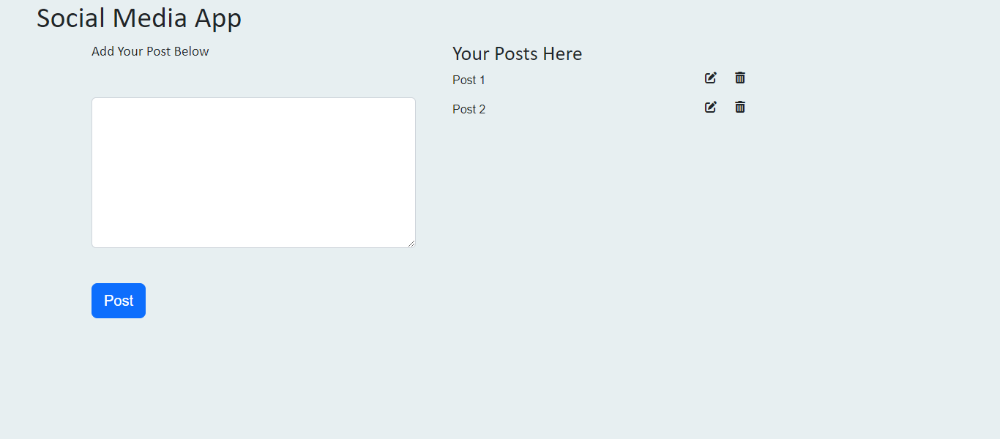

# Crud-App
 
<h1> Social Media Crud App</h1>

It was created Using Html and Javascript and it was styled with bootstrap and css
   users have the ability to create a post and  upload it to the screen 
  as well as delete the post using the icons.

